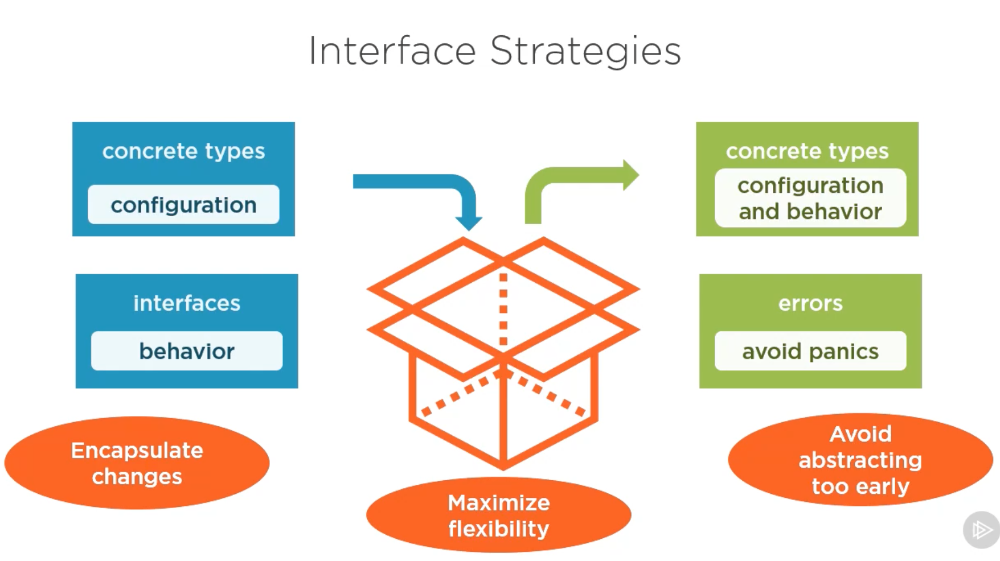

# go-packages

[Go Packages Documentation](https://go.dev/ref/spec#Packages)

A package is constructed from one of more source files that together declare constants, types, variables, and functions belonging to the package and which are accessible in all fields of the same package.

### Packages from the file system view
- A package includes all Go source files in a single directory
    - All subdirectories are excluded.

### Package Elements
#### Source File
- There will always be a package declaration
- We can have documentation that's elevated to the package level
- We can import other packages into our package
- We can have var/const blocks, types/interfaces, and define functions.

### Library Packages
- Designed to be consumed by another package
    - Could be a another library or an executable program
- The name of the package must match the directory name 
- Should provide a focused set of related features (design methodology)

### Main Packages 
- Defines a singe application entry point
- Go projects might have multiple entry points depending on what you're trying to do.
- Contains a main function, which is what Go runtime uses to figure out where to start.
- Can be in any directory. 
- Focuses on app setup and initialization 
    - No business logic, only an interface between an app and its environment.

### Standard Library Packages
- `doc.go` files are recognized by the compiler as containing documentation for our package.
- Anything left-aligned inside a source file is probably something defined at the package level.
- `func init()` 
    - Can have multiple init functions in the same source file.
    - The only function that can be defined twice!
    - If we have multiple, we don't control the order in which they're called.
    - Main init will be called last, because first it pulls in its imports and initializes its variables before initializing its own.
    - You can't just call an `init()` that's handled as the package initializes
- Normally when you're defining a package you have to match the package name with the directory name, but `main` packages can be anywhere. See `generate_cert.go` in the Go standard library.

### Working Within a Package

#### Naming Packages
- Short AND clear
- Always lowercase
- No underscores
- Prefer nouns over verbs
- Abbreviate carefully
- Don't steal good names from the user like `user` or `action`

#### Naming Package Contents
- Avoid stutter
    - Bad: `http.HTTPServer`, `json.JSONEncoder`
    - Good: `http.Server`, `json.Encoder`
- Simplify function names
    - Bad: `time.NewTime`, `db.ConnectToDatabase`
    - Good: `time.Time`, `db.Connect`

### Lifecycle of a Package
1. Import required packages
2. Set variables to initial values
3. Call `init()` function

### Preparing a Package to Be Used

#### Member Visibility
Three types of visibility:
1. Public Scope
    - Capitalize member
    - Available to all consumers
2. Package Scope 
    - Lowercase member
    - Only available within package
    - This is the minimum scope we typically deal with (there is no private)
3. Interal Package
    - Can use public- and package-level members
    - Scoped to parent package and its descendants

### Documenting a Package

#### Documenting the package itself
- Licensing
- Package comments (starts with "Package" - first sentence will be used by Go)
- Package declaration comes after
- If there is much to say, use `doc.go`
    - Licensing commented with `//`
    - Package info commented with `/* */`
    - Followed by package declaration

#### Documenting public package members
- Use complete sentences
- Start first sentence with element's name
- Write first sentence as a short description of the element

#### Designing a package
- Provide a clear solution
    - Single responsibility
    - Cohesive API
- Focus on the consumer
    - Simple to use
    - Minimize API
    - Encapsulate changes
- Maximize reusability
    - Reduce dependencies
    - Minimize scope

#### Interface strategies

Receiving data into our package:
- Concrete types
    - Configuration
- Interfaces
    - Behavior
        - "Hey I just need to have these behaviors defined, and how you do that is not my problem"
        - Gives consumer maximum flexibility

Data coming out of our package:
- Concrete types
    - Preferable so you can return methods and data so your consumer doesn't have to drill through a bunch of methods to get the data they ask your package to generate for them.
- Return errors
    - Avoid panics
        - Very rarely does a library know that the application can no longer continue to execute. Almost always the responsibility of the consuming application.

This philosophy allows us to...
- Encapsulate changes
- Maximize flexibility
- Avoid abstracting too early

Data-in 
- Concrete types
    - Request object `net/http.Request` defines configuration for an http request.
- Interfaces
    - Handler is a way to to interpret an http request coming in on a given path. So by defining that type as an interface, the consumer of the `net/http` package has all of the flexibility to define that handler type in any way that we want.

Data-out 
- Concrete types
    - `net/http.Response` network response comes back as a concrete type. We can get all the URL information from it, response body, headers, etc.
- Errors
    - `net/http.Get` Get function returns a response object, but also returns an optional error object. Common for network requests to fail.